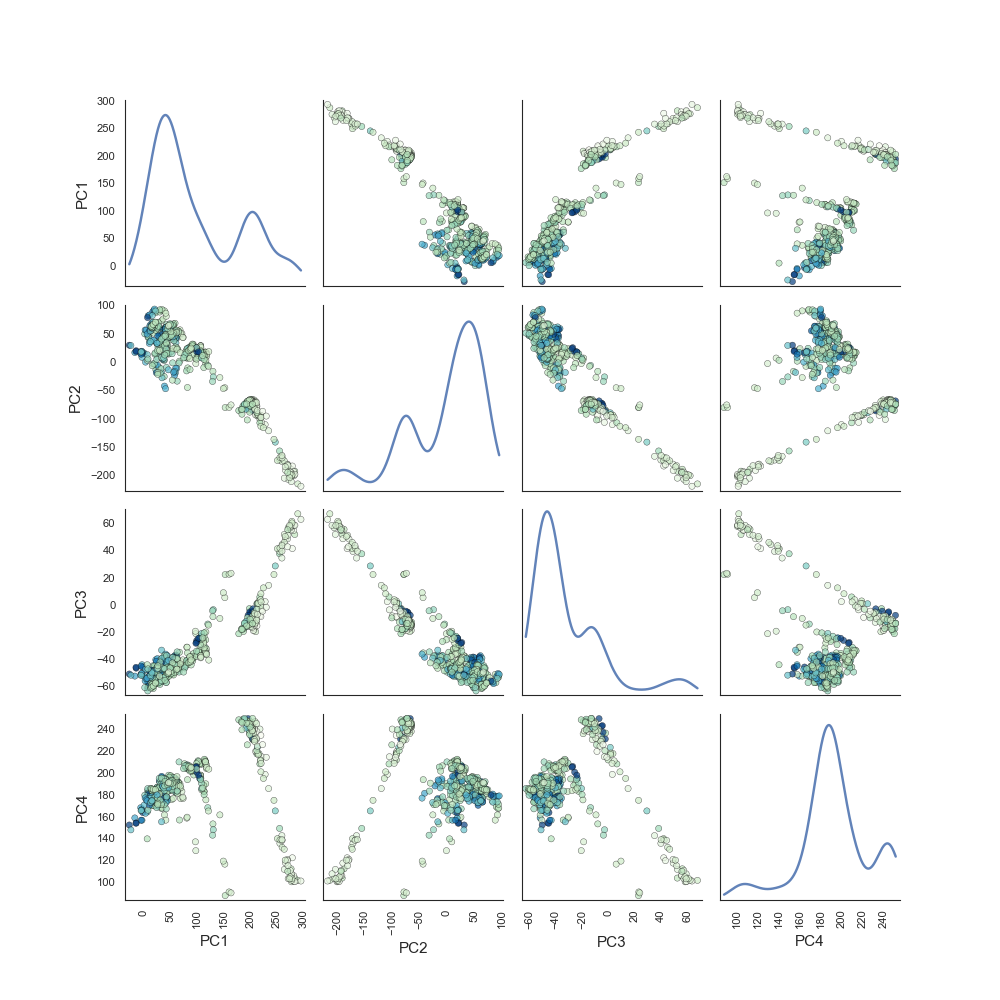

========
Usage
========

Below are some demonstrations of using Regressors in a project. We'll import a
the Boston data set first to demonstrate the functions' usage::

    import numpy as np
    from sklearn import datasets
    boston = datasets.load_boston()
    which_betas = np.ones(13, dtype=bool)
    which_betas[3] = False  # Eliminate dummy variable
    X = boston.data[:, which_betas]
    y = boston.target

Obtaining Summary Statistics
----------------------------

There are several functions provided that compute various statistics
about some of the regression models in scikit-learn. These functions are:

    1. `regressors.stats.sse(clf, X, y)`
    2. `regressors.stats.adj_r2_score(clf, X, y)`
    3. `regressors.stats.coef_se(clf, X, y)`
    4. `regressors.stats.coef_tval(clf, X, y)`
    5. `regressors.stats.coef_pval(clf, X, y)`
    6. `regressors.stats.f_stat(clf, X, y)`
    7. `regressors.stats.residuals(clf, X, y)`
    8. `regressors.stats.summary(clf, X, y, Xlabels)`

The last function, `summary()`, outputs the metrics seen above in a nice format.

An example with is developed below for a better understanding of these
functions. Here, we use an ordinary least squares regression model, but another,
such as Lasso, could be used.

SSE
~~~

To calculate the SSE::

    from sklearn import linear_model
    from regressors import stats
    ols = linear_model.LinearRegression()
    ols.fit(X, y)

    stats.sse(ols, X, y)

Output: 11299.555410604258

Adjusted R-Squared
~~~~~~~~~~~~~~~~~~

To calculate the adjusted R-squared::

    from sklearn import linear_model
    from regressors import stats
    ols = linear_model.LinearRegression()
    ols.fit(X, y)

    stats.adj_r2_score(ols, X, y)

Output: 0.72903560136853518

Standard Error of Beta Coefficients
~~~~~~~~~~~~~~~~~~~~~~~~~~~~~~~~~~~

To calculate the standard error of beta coefficients::

    from sklearn import linear_model
    from regressors import stats
    ols = linear_model.LinearRegression()
    ols.fit(X, y)

    stats.coef_se(ols, X, y)

Output: array([  4.91564654e+00,   3.15831325e-02,   1.07052582e-02,
                  5.58441441e-02,   3.59192651e+00,   2.72990186e-01,
                  9.62874778e-03,   1.80529926e-01,   6.15688821e-02,
                  1.05459120e-03,   8.89940838e-02,   1.12619897e-03,
                  4.21280888e-02])

T-values of Beta Coefficients
~~~~~~~~~~~~~~~~~~~~~~~~~~~~~

To calculate the t-values beta coefficients::

    from sklearn import linear_model
    from regressors import stats
    ols = linear_model.LinearRegression()
    ols.fit(X, y)

    stats.coef_tval(ols, X, y)

Output: array([  7.51173468,  -3.55339694,   4.39272142,   0.72781367,
                -4.84335873,  14.08541122,   0.29566133,  -8.22887   ,
                 5.32566707, -13.03948192, -11.14380943,   8.72558338,
                -12.69733326])

P-values of Beta Coefficients
~~~~~~~~~~~~~~~~~~~~~~~~~~~~~

To calculate the p-values of beta coefficients::

    from sklearn import linear_model
    from regressors import stats
    ols = linear_model.LinearRegression()
    ols.fit(X, y)

    stats.coef_pval(ols, X, y)

Output: array([  2.66897615e-13,   4.15972994e-04,   1.36473287e-05,
                 4.67064962e-01,   1.70032518e-06,   0.00000000e+00,
                 7.67610259e-01,   1.55431223e-15,   1.51691918e-07,
                 0.00000000e+00,   0.00000000e+00,   0.00000000e+00,
                 0.00000000e+00])

F-statistic
~~~~~~~~~~~

To calculate the F-statistic of beta coefficients::

    from sklearn import linear_model
    from regressors import stats
    ols = linear_model.LinearRegression()
    ols.fit(X, y)

    stats.f_stat(ols, X, y)

Output: 114.22612261689403

Summary
~~~~~~~

The summary statistic table calls many of the stats outputs the statistics in
an pretty format, similar to that seen in R.

The coefficients can be labeled more descriptively by passing in a list of
lables. If no labels are provided, they will be generated in the format x1, x2,
x3, etc.

To obtain the summary table::

    from sklearn import linear_model
    from regressors import stats
    ols = linear_model.LinearRegression()
    ols.fit(X, y)

    xlabels = boston.feature_names[which_betas]
    stats.summary(ols, X, y, xlabels)

Output::

    Residuals:
         Min      1Q  Median      3Q      Max
    -26.3743 -1.9207  0.6648  2.8112  13.3794

    Coefficients:
                 Estimate  Std. Error  t value   p value
    _intercept  36.925033    4.915647   7.5117  0.000000
    CRIM        -0.112227    0.031583  -3.5534  0.000416
    ZN           0.047025    0.010705   4.3927  0.000014
    INDUS        0.040644    0.055844   0.7278  0.467065
    NOX        -17.396989    3.591927  -4.8434  0.000002
    RM           3.845179    0.272990  14.0854  0.000000
    AGE          0.002847    0.009629   0.2957  0.767610
    DIS         -1.485557    0.180530  -8.2289  0.000000
    RAD          0.327895    0.061569   5.3257  0.000000
    TAX         -0.013751    0.001055 -13.0395  0.000000
    PTRATIO     -0.991733    0.088994 -11.1438  0.000000
    B            0.009827    0.001126   8.7256  0.000000
    LSTAT       -0.534914    0.042128 -12.6973  0.000000
    ---
    R-squared:  0.73547,    Adjusted R-squared:  0.72904
    F-statistic: 114.23 on 12 features

Plotting
--------

Several functions are provided to quickly and easily make plots useful for
judging a model. We will continue using the Boston data set referenced above.

Principle Components Pairs
~~~~~~~~~~~~~~~~~~~~~~~~~~

To generate a pairwise plot of principle components::

    from sklearn import preprocessing
    from sklearn import decomposition
    from regressors import plots
    scaler = preprocessing.StandardScaler()
    x_scaled = scaler.fit_transform(X)
    pcomp = decomposition.PCA()
    pcomp.fit(x_scaled)

    plots.plot_pca_pairs(pcomp, X, y, n_components=4, cmap="GnBu")

Plots:

.. image:: pca_pairs_plot.png

    #***********************************
    # * Plot Principal Component Pairs *
    #***********************************

    # Example 1
    import numpy as np
    from sklearn.cross_validation import train_test_split
    iris = sns.load_dataset("iris")  # sample data set
    species = np.array(iris['species'].values, dtype=str)  # set the 'species' aside as Y categorical response variable
    X = iris.iloc[:,:4].as_matrix()  # create matrix of X precictor variables

    X_train, X_test, t_train, t_test = train_test_split(X, species,
                                                    train_size=0.8,
                                                    random_state=1)
    plot_pca_pairs(X_train, t_train, 4, 2, 'hist', 'Species')

    # Example 2
    from sklearn import decomposition
    import numpy as np
    iris = sns.load_dataset("iris")
    species = np.array(iris['species'].values, dtype=str)
    X = iris.iloc[:,:4].as_matrix()
    pcomp = decomposition.PCA(n_components=4)
    pcomp.fit(X)

    plot_pca_pairs(clf_pca=pcomp, x_train=X, n_comps=4, y=species)

    #***********************************
    # * Get Beta Coefficients from PCA *
    #***********************************
    import statsmodels.api as sm
    dta = sm.datasets.fair.load_pandas().data  # sample dataset
    dta['affair'] = (dta['affairs'] > 0).astype(float)  # adds Y to dataframe based on 'affairs' values
    X = dta.ix[:, 0:8].as_matrix()  # want only X data; take Y out; convert it from pandas.dataframe to numpy.matrix
    Y = np.array(dta['affair'])  # set the Y response to a numpy.array

    # perform PCA/PCR. The pcr() function returns a tuple(mspe.mean(), mse.mean(), ols, pcomp)
    tmp = pcr(X, Y, num_components=4, k=10)
    ols = tmp[2]
    pcomp = tmp[3]

    # send the OLS and PCA object into the pca_beta_coeffs() fxn
    print(pca_beta_coeffs(ols, pcomp))

